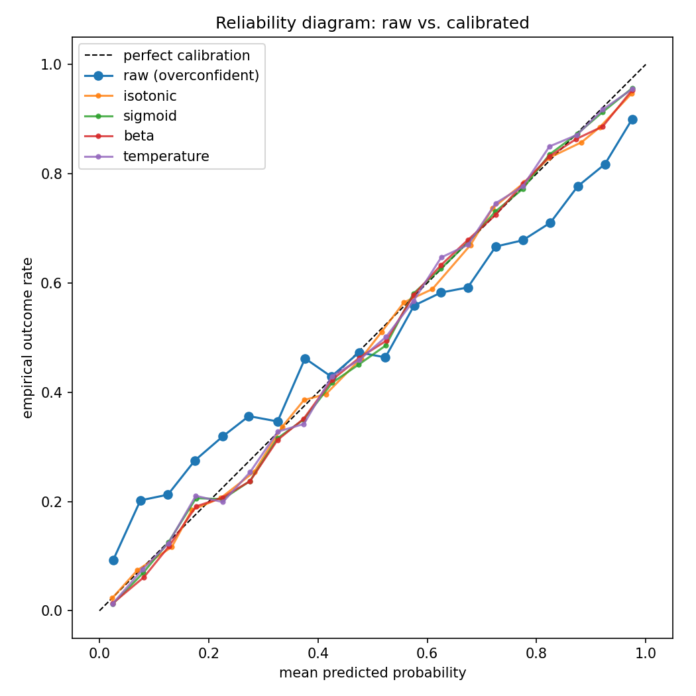

# prediction-modeling-toolkit

Calibration, evaluation, ensembling, and stake-sizing infrastructure for
probabilistic prediction systems — built for multi-sport game prediction,
applicable to any probabilistic forecasting problem.

Every module consumes and returns plain arrays and dicts. Storage, model
registries, and data access are the caller's problem — there is no database
dependency anywhere in this package.

## Install

```bash
pip install -e ".[dev,examples]"
```

## Quickstart

```python
import numpy as np
from pmt.calibration import fit_calibration_curve, apply_curve
from pmt.evaluation import evaluate_predictions

# val_probs / val_outcomes: held-out model probabilities and 0/1 outcomes
curve = fit_calibration_curve(val_probs, val_outcomes, method="isotonic")

# The curve is a plain JSON-serializable dict — store it anywhere.
calibrated = apply_curve(test_probs, curve)
print(evaluate_predictions(test_outcomes, calibrated))
```

## Modules

| Module | What it does |
|---|---|
| `pmt.calibration` | Fit calibration curves (isotonic, Platt sigmoid, temperature, beta) as serializable dicts; apply them at prediction time, including per-class multiclass calibration with renormalization. |
| `pmt.evaluation` | Brier score (binary + multiclass), log-loss, ECE; time-series cross-validation; temporal train/calibrate/evaluate splits that make leakage structurally impossible. |
| `pmt.staking` | Modified Kelly stake sizing — market-relative skill, probability shrinkage, edge gating — plus empirical bin trust weights learned from realized P&L ([formula walkthrough](docs/stake_sizing.md)). |
| `pmt.ratings` | Configurable Elo engine: dynamic K schedules, season carryover regression, capped margin-of-victory adjustment, per-team home advantage, Glicko-style rating deviation. |
| `pmt.ensembling` | *(coming)* Abstract stacking framework with temporal anti-leakage guards. |
| `pmt.pipeline` | Step-based pipeline orchestration (skip conditions, per-step failure policy, observer hooks) plus thread-pool parallelism patterns with progress tracking. |

## Examples

```bash
python examples/01_calibration_methods.py   # metrics table + reliability diagram
python examples/02_bins_trust_kelly.py      # P&L bins -> trust weights -> Kelly stakes
python examples/03_elo_season.py            # Elo convergence + season carryover
python examples/05_pipeline_demo.py         # orchestration: skip/failure/parallel
python examples/make_gallery.py             # regenerate calibration gallery charts
```

Fits all four calibration methods on a synthetic overconfident classifier
and renders a reliability diagram comparing them:



More charts (fitted curve shapes, empirical bins, temperature family,
temporal-split evaluation) in [`docs/gallery/`](docs/gallery/README.md) —
all generated from synthetic data by the example scripts.

## Background

Extracted from the shared infrastructure layer of a private multi-sport
prediction platform (6 sports, nightly retraining, market execution). The
feature engineering and model composition stay private; the math and
machinery are here. See `docs/architecture.md` for the system overview.

## License

MIT
